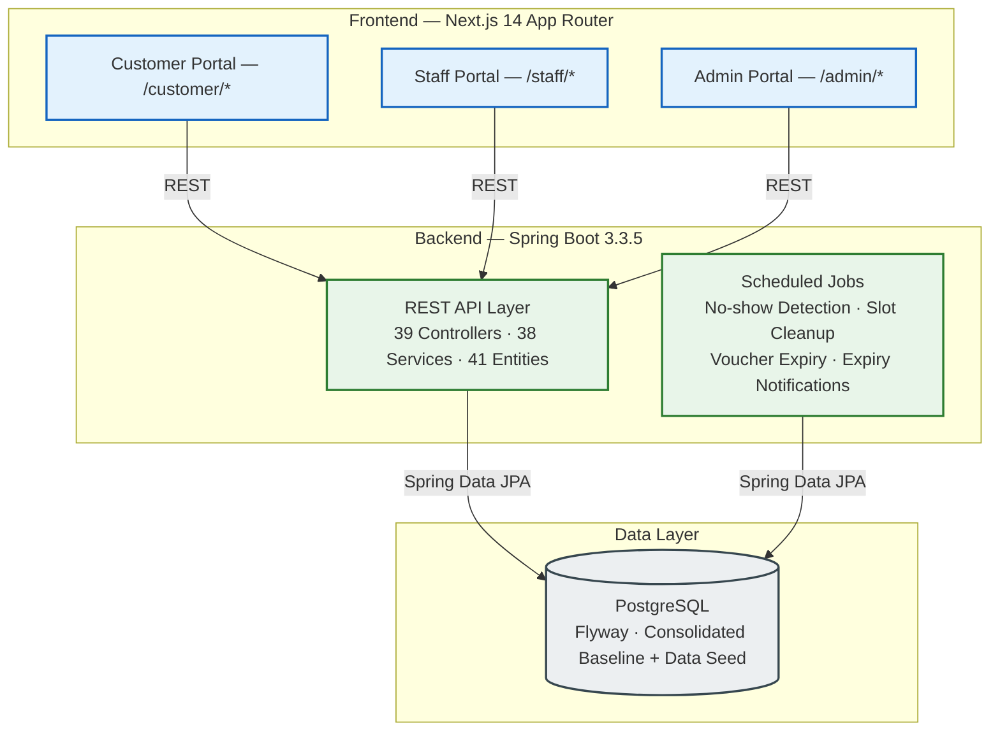

<p align="center">
  
  
  
  
  
  
  
  
</p>

<h1 align="center">🚗 AutoWash Pro — Smart Car Wash Management System</h1>
<p align="center">
  <em>A full-stack web application for managing and operating an automated car wash service center.</em>
</p>

<p align="center">
  <a href=".github/workflows/ci.yml"></a>
  <a href=".github/dependabot.yml"></a>
  
</p>

---

## Overview

**AutoWash Pro** is a comprehensive, modular monolith application designed to systematically digitize and streamline the end-to-end operational workflows of a modern car wash service center. The architecture accommodates three distinct user roles—**Customer**, **Staff**, and **Admin**—each interacting through specialized portals integrated within a unified Next.js frontend, seamlessly supported by a robust Spring Boot REST API layer.

This software solution was engineered as a capstone fulfillment for the **SWP391 – Software Development Project** curriculum at **FPT University Ho Chi Minh City** (Summer 2026).

---

## System Architecture



---

## Tech Stack

| Layer | Technologies |
|---|---|
| **Frontend** | Next.js 14.2 (App Router) · React 18 · TypeScript · Tailwind CSS · Zustand · TanStack Query v5 · Axios · React Hook Form · Recharts · Shadcn UI (Radix) |
| **Backend** | Spring Boot 3.3.5 · Java 21 · Spring Security · Spring Data JPA · Flyway · JWT (JJWT) · Lombok |
| **Database** | PostgreSQL · Flyway migrations (Consolidated Baseline V1 + Seed V28) |
| **DevOps** | GitHub Actions (CI) · Dependabot · OpenAPI / Swagger UI |

---

## Project Structure

```text
CarWash/
├── autowash-frontend/                 # Next.js 14 — Feature-Sliced Design
│   └── src/
│       ├── app/                       # App Router (3 role-based route groups + auth)
│       ├── entities/                  # Business entity types & interfaces
│       ├── features/                  # 23 feature modules (auth, bookings, loyalty, ...)
│       ├── views/                     # Page-level compositions
│       ├── widgets/                   # Reusable layout blocks
│       ├── shared/                    # UI design system, API client, store, utils
│       └── middleware.ts              # Auth guards & role-based redirects
│
├── autowash-backend/                  # Spring Boot 3.3.5 — Layered Architecture
│   └── src/main/java/com/autowash/
│       ├── config/                    # Security, CORS, JWT, Swagger
│       ├── controller/               # 39 REST controllers
│       ├── service/                   # 38 service interfaces + implementations
│       ├── entity/                    # 41 JPA entities + enums
│       ├── repository/               # Spring Data JPA repositories
│       ├── dto/                      # Request / Response DTOs
│       ├── job/                      # 4 scheduled background jobs
│       └── shared/                   # Error codes, utilities
│
└── docs/                             # Technical documentation
    ├── master/                       # PROJECT.md · BUSINESS_RULES.md
    └── context/                      # BACKEND_CONTEXT.md · FRONTEND_CONTEXT.md
```

---

## Getting Started

### Prerequisites

- Node.js ≥ 18.18
- Java JDK 21
- Maven ≥ 3.9
- PostgreSQL

### Default Ports

| Service | Port | URL |
|---|---|---|
| Frontend | `3000` | http://localhost:3000 |
| Backend | `8080` | http://localhost:8080/api/v1 |
| Swagger UI | — | http://localhost:8080/swagger-ui.html |
| PostgreSQL | `5432` | `jdbc:postgresql://localhost:5432/autowash` |

### Backend

```bash
cd autowash-backend
mvn clean install
mvn spring-boot:run "-Dspring-boot.run.profiles=local"
```

### Frontend

```bash
cd autowash-frontend
cp .env.example .env.local
npm install
npm run dev
```

> `.env.local` is git-ignored. Each developer creates it from `.env.example` on first clone.

---

## Development Workflow

```
feature/* branch → Local dev & test → Push → Pull Request → CI checks → Code review → Merge
```

- **Protected branches:** `main` and `dev` require PR approval + CI pass
- **CI pipeline:** GitHub Actions runs Next.js build + Maven test on every PR
- **Dependency management:** Dependabot scans weekly for security vulnerabilities

---

## Documentation

| Document | Description |
|---|---|
| [`PROJECT.md`](docs/master/PROJECT.md) | Project specification and requirements |
| [`BUSINESS_RULES.md`](docs/master/BUSINESS_RULES.md) | Comprehensive business rules registry (~240 rules) |
| [`BACKEND_CONTEXT.md`](docs/context/BACKEND_CONTEXT.md) | Backend architecture and implementation details |
| [`FRONTEND_CONTEXT.md`](docs/context/FRONTEND_CONTEXT.md) | Frontend architecture and component documentation |

---

## Team

Developed by students at **FPT University Ho Chi Minh City** — Summer 2026:

| Student ID | Name | Contact |
| :---: | :--- | :--- |
| SE191116 | Hà Thúc Quốc Hùng | [htquochung.nt@gmail.com](mailto:htquochung.nt@gmail.com) |
| SE192041 | Phạm Hoàng Gia Huy | [giahuy250349@gmail.com](mailto:giahuy250349@gmail.com) |
| SE193449 | Lê Đoàn Gia Hưng | [lhung291005@gmail.com](mailto:lhung291005@gmail.com) |
| SE194643 | Tống Vỹ Thuận | [tongvy900@gmail.com](mailto:tongvy900@gmail.com) |

---

<p align="center"><em>© 2026 FPT University HCMC. All rights reserved.</em></p>
